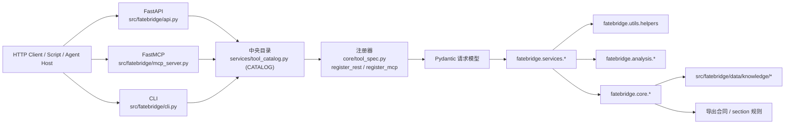
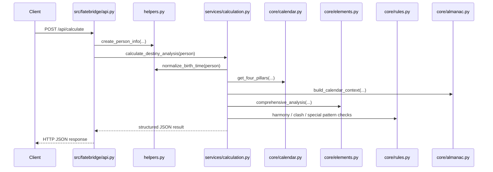
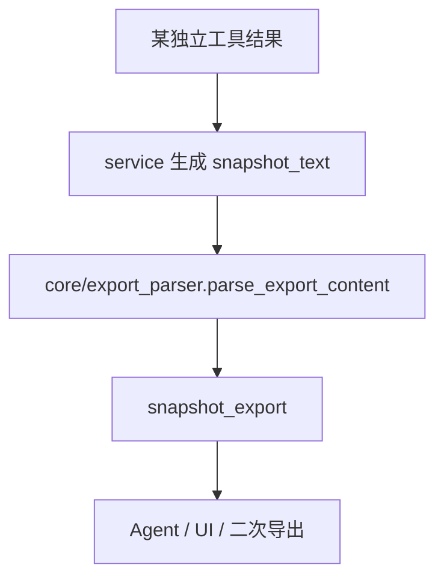

# FateBridge 架构说明

本文档描述当前仓库的真实结构、运行路径和设计取舍。FateBridge 当前是一个 backend-only Python 仓库，同一套领域能力通过 FastAPI、FastMCP 与命令行（`fatebridge` CLI）三条通道暴露，三者都从同一份中央工具目录（`src/fatebridge/services/tool_catalog.py`）自动派生。

## 1. 系统边界

### 核心结论

- `src/fatebridge/api.py`、`src/fatebridge/mcp_server.py` 和 `src/fatebridge/cli.py` 是三层 transport adapter，不承担核心算法
- 三层 transport 共享同一份中央目录 `src/fatebridge/services/tool_catalog.py`（`CATALOG: List[ToolSpec]`），由 `src/fatebridge/core/tool_spec.py` 的 `register_rest` / `register_mcp` 自动挂载；新增工具只需追加一个 `ToolSpec`，无需改动任何 transport 文件
- `src/fatebridge/services` 是服务编排层，负责把 transport 输入转换成核心算法调用
- `src/fatebridge/core` 是主要算法层
- `src/fatebridge/utils/helpers.py` 是输入归一化和真太阳时修正的关键入口
- `src/fatebridge/data/knowledge` 与导出合同共同构成了“结果可消费层”
- `src/fatebridge/services/run_metadata.py` 为 REST / MCP 统一补充轻量 `run_metadata`

## 2. 分层职责

| 层 | 主要文件 | 职责 |
| --- | --- | --- |
| 中央目录 | `src/fatebridge/services/tool_catalog.py`, `src/fatebridge/core/tool_spec.py` | 以 `ToolSpec` 单点声明全部工具，并提供 `register_rest` / `register_mcp` 注册器 |
| 传输层 | `src/fatebridge/api.py`, `src/fatebridge/mcp_server.py`, `src/fatebridge/cli.py` | 从中央目录派生 REST 路由 / MCP 工具 / CLI 子命令，做请求模型绑定与 HTTP/MCP/CLI 错误包装 |
| 服务层 | `src/fatebridge/services/*.py` | 编排核心算法、拼装响应、生成 `snapshot_text` / `snapshot_export` |
| 分析层 | `src/fatebridge/analysis/*.py` | 复合分析逻辑，如配合度和时运影响 |
| 核心层 | `src/fatebridge/core/*.py` | 历法、八字、占星、占术、导出解析、知识索引 |
| 通用工具层 | `src/fatebridge/utils/*.py` | 出生信息模型、地点解析、真太阳时、公共格式化 |
| 数据层 | `src/fatebridge/data/knowledge/*.json` | 内置知识 bundle |
| 测试层 | `tests/*.py` | API/MCP 对齐、合同回归、算法回归 |

## 3. 代码地图

### 3.1 中央目录与 Transport

- `src/fatebridge/services/tool_catalog.py`
  - 唯一的 `CATALOG: List[ToolSpec]`，单点声明全部工具
  - `rest_specs()` / `mcp_specs()` 过滤出各 transport 暴露的工具集合
- `src/fatebridge/core/tool_spec.py`
  - `ToolSpec` 冻结 dataclass，以及 `register_rest` / `register_mcp` 注册器
  - 统一的字段投影（`project_fields`）、错误形状（`invalid_input_result`）与参数 schema 生成
- `src/fatebridge/api.py`
  - 定义 FastAPI app、CORS，调用 `register_rest(app, rest_specs())`
  - 暴露 80 个业务 REST 路由（另含 `/health`、`/ready`、`/metrics` 三个运维端点）
- `src/fatebridge/mcp_server.py`
  - 定义 FastMCP app，调用 `register_mcp(app, mcp_specs())`
  - 暴露 80 个 MCP 工具，返回 JSON 字符串，适合 Agent host 直接消费
- `src/fatebridge/cli.py`
  - 遍历 `CATALOG` 为每个工具生成 argparse 子命令
  - 提供 `fatebridge list` / `fatebridge describe <tool>` 供 Agent 自助发现 schema 与示例

### 3.2 Services

| 文件 | 职责 |
| --- | --- |
| `src/fatebridge/services/calculation.py` | 单人命理分析 |
| `src/fatebridge/services/compatibility.py` | 双人配合分析 |
| `src/fatebridge/services/timing.py` | 综合时运、大运、流年、流月、流日、流时、节气时间轴、calendar helper |
| `src/fatebridge/services/divination.py` | 梅花、卦义、统摄法、六爻、宿占、占星骰子、三式合一 |
| `src/fatebridge/services/metaphysics.py` | 紫微、六壬、奇门、太乙、金口诀 |
| `src/fatebridge/services/astrology.py` | 核心盘、关系盘、中点盘以及对应快照 |
| `src/fatebridge/services/western_timing.py` | 西占推运总览 |
| `src/fatebridge/services/western_timing_tools.py` | 独立 western timing technique 工具 |
| `src/fatebridge/services/knowledge.py` | 内置知识目录与条目读取 |
| `src/fatebridge/services/export_tools.py` | 导出注册表与快照解析 |
| `src/fatebridge/services/bazi.py` | 八字命盘与直断的独立快照输出 |
| `src/fatebridge/services/western_lifespan.py`, `western_events.py`, `western_horary.py`, `western_election.py` | 寿元、择时事件、卜卦、择吉等西占工具 |
| `src/fatebridge/services/tool_catalog.py` | 中央工具目录（`ToolSpec` / `CATALOG`），三端唯一信源 |
| `src/fatebridge/services/run_metadata.py` | 统一生成 `run_id` / `trace_id` / `tool_name` / `generated_at` / `engine` |

### 3.3 Core

| 文件 | 职责 |
| --- | --- |
| `src/fatebridge/core/calendar.py` | 四柱计算、干支历法 |
| `src/fatebridge/core/almanac.py` | 节气、农历、calendar context |
| `src/fatebridge/core/elements.py` | 五行、十神、日主强弱 |
| `src/fatebridge/core/rules.py` | 格局、合冲刑害等规则 |
| `src/fatebridge/core/timing.py` | 时运基础算法 |
| `src/fatebridge/core/divination.py` | 梅花易数与卦义核心 |
| `src/fatebridge/core/gua_meanings.py` | 八卦/六十四卦离线断辞 |
| `src/fatebridge/core/astrology.py` | 核心占星盘、关系盘、近似/高精度双路径 |
| `src/fatebridge/core/astrology_lifespan.py`, `astrology_events.py`, `astrology_horary.py`, `astrology_election.py` | 寿元、事件、卜卦、择吉等古典/西占算法 |
| `src/fatebridge/core/predictive/*.py` | 返照(`returns`)、行运(`transit`)、主限(`primary_directions`)、太阳弧(`solar_arc`)、小限(`profections`)、黄道释放(`zodiacal_releasing`)、法达(`firdaria`)、十年星限(`decennials`) 等推运技法 |
| `src/fatebridge/core/local_techniques.py` | 宿占、占星骰子、三式本地适配 |
| `src/fatebridge/core/export_contracts.py` | section 预设、导出规则、标准化 |
| `src/fatebridge/core/export_parser.py` | `snapshot_text -> snapshot_export` 解析 |
| `src/fatebridge/core/knowledge_store.py` | 内置知识索引与读取 |

## 4. 典型请求流

### 4.1 单人命理分析

这一条链路说明了 FateBridge 的一个核心原则：时间、地点和真太阳时修正必须先被标准化，然后才进入算法层。

### 4.2 快照导出流

这套机制让大量工具共享一致的“可读文本 + 可筛选导出”合同，而不是各自发明私有输出格式。

## 5. 关键设计决策

### 5.1 三 transport，单目录

FateBridge 没有为 REST / MCP / CLI 分别维护三套领域逻辑或三份工具定义。每个工具只在 `src/fatebridge/services/tool_catalog.py` 中以 `ToolSpec` 声明**一次**，再由 `src/fatebridge/core/tool_spec.py` 的 `register_rest` / `register_mcp` 和 `cli.py` 的目录遍历自动派生到三个接口；真正算法都下沉到 `services` / `core`。

好处：

- REST、MCP、CLI 三端的工具集合、参数 schema 与错误形状天然一致
- 三端 parity 由 `tests/test_full_surface_validation.py` 锁定：任一端与目录漂移即 CI 失败
- 新增能力无需触碰任何 transport 文件，降低出错面
- 文档可以按能力域组织，而不是按 transport 分裂

### 5.2 输入归一化前置

`fatebridge.utils.helpers` 统一处理以下问题：

- 出生地文本解析
- 时区名解析
- 经度补全
- 真太阳时修正
- 标准化出生时刻对象

这是 FateBridge 非常关键的稳定器，因为几乎所有八字、时运与部分 metaphysics 工具都依赖这条链路。

### 5.3 快照协议统一

很多术数工具天然适合“读一段说明”，但系统集成又需要结构化 section。FateBridge 的选择是同时输出：

- `snapshot_text`：面向人读
- `snapshot_export`：面向机器和二次消费

这让同一份结果既能给开发者看，也能给 Agent 继续拆解、裁剪和转述。

### 5.4 占星采用双精度路径

`fatebridge.core.astrology` 的策略是：

1. 若本地 `swisseph` 可用，优先走本地高精度路径
2. 若不可用，保留完全离线的近似轨道模型

这意味着：

- 核心 chart 家族具备“能跑起来”的兜底能力
- 但高阶 house system override 不会在缺失 `swisseph` 时假装精确，而是直接报错

### 5.5 西占推运不做静默降级

与核心 chart 不同，`fatebridge.core.predictive.*` 与各 `fatebridge.core.astrology_*` 推运模块明确依赖 `kerykeion` / Swiss Ephemeris 运行时。缺依赖时，FateBridge 会直接报错，而不是伪造近似推运结果。

这是一个准确性优先的设计选择。

## 6. 运行时与配置

默认运行参数来自 `src/fatebridge/api.py`：

- `API_HOST=0.0.0.0`
- `API_PORT=8010`
- `ALLOWED_ORIGINS=http://localhost:3000`

`src/fatebridge/mcp_server.py` 则通过 `app.run()` 启动 FastMCP 服务。

## 7. 测试策略

当前测试大致分为四类：

- 领域能力测试：如 `tests/test_chinese_metaphysics.py`
- 占星与推运测试：如 `tests/test_astrology_tools.py`、`tests/test_western_timing_tools.py`
- API/MCP 对齐测试：`tests/test_api_alignment.py`
- 合同/导出测试：`snapshot_text`、`snapshot_export`、`selected_sections`

对于文档来说，最重要的事实是：FateBridge 不是只测算法本身，也在测 transport 层结果是否一致。

## 8. 扩展方式

新增一个能力时，推荐遵循下面的顺序：

1. 在 `core` 实现或补充底层算法
2. 在 `services` 中封装领域返回结构
3. 在 `src/fatebridge/core/request_models.py` 定义该工具的 Pydantic 请求模型
4. **在 `src/fatebridge/services/tool_catalog.py` 的 `CATALOG` 中追加一个 `ToolSpec`** —— REST 路由、MCP 工具、CLI 子命令会自动派生，无需改动 `api.py` / `mcp_server.py` / `cli.py`
5. 在 `tests/` 增加能力测试；三端 parity 由 `tests/test_full_surface_validation.py` 自动覆盖，记得为新工具补一个代表性 payload fixture
6. 更新 [api-reference.md](api-reference.md) 和 [algorithm-coverage.md](algorithm-coverage.md)（工具计数由 `tests/test_doc_tool_counts.py` 锁定，改动后若计数变化需同步）

## 9. 当前非目标

以下内容当前不在仓库架构内：

- 内置 Web 前端
- 数据库存储与账户体系
- 任务编排平台、队列、缓存层
- 多服务拆分

因此阅读和扩展本仓库时，应把它理解为“单仓库、多能力的 Python 领域服务”，而不是完整产品栈。
