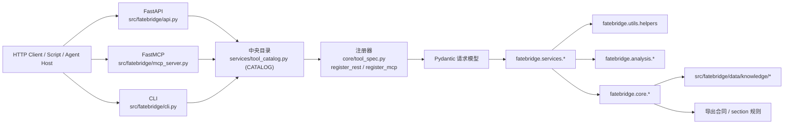
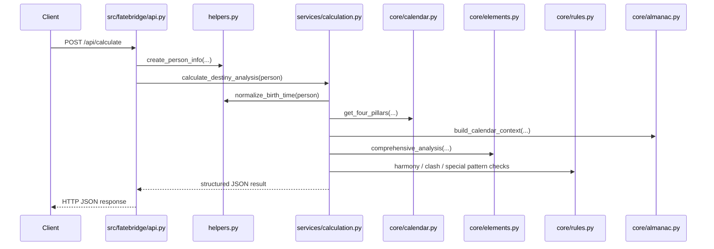
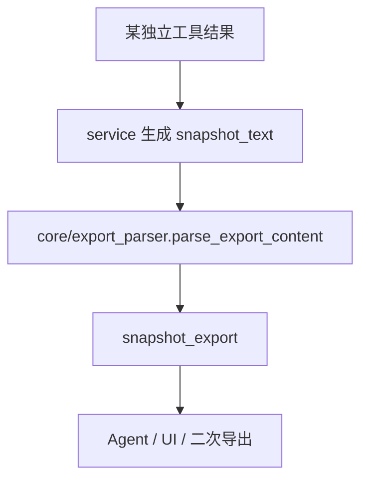

# FateBridge 架构说明

本文档描述 FateBridge 仓库的真实结构、运行路径与设计取舍。当前 FateBridge 是一个纯后端 Python 项目，同一套命理与占星领域能力通过 FastAPI、FastMCP 和 `fatebridge` CLI 三种方式对外提供。三种接口并非各自维护独立逻辑，而是从同一份中央工具目录 `src/fatebridge/services/tool_catalog.py` 自动派生。

## 系统概览

从上图可以看出，整个仓库的核心结构非常清晰：`src/fatebridge/api.py`、`src/fatebridge/mcp_server.py` 和 `src/fatebridge/cli.py` 只是三层 transport adapter，不承担核心算法。三个接口共享同一份中央目录 `src/fatebridge/services/tool_catalog.py`，其中 `CATALOG` 是一个 `List[ToolSpec]`。`src/fatebridge/core/tool_spec.py` 提供了 `register_rest` 和 `register_mcp` 两个注册器，自动把目录中的工具挂载到 REST 和 MCP 上；CLI 则直接遍历同一份目录生成子命令。新增工具时只需追加一个 `ToolSpec`，完全不需要改动任何 transport 文件。

再往下，`src/fatebridge/services` 负责把 transport 输入转换成核心算法调用；`src/fatebridge/core` 是主要算法层；`src/fatebridge/utils/helpers.py` 是出生信息归一化和真太阳时修正的关键入口；`src/fatebridge/data/knowledge` 与导出合同共同构成结果的可消费层；`src/fatebridge/services/run_metadata.py` 则为 REST 和 MCP 统一补充 `run_id`、`trace_id`、`tool_name`、`generated_at`、`engine` 等轻量运行元数据。

## 分层职责

仓库大致分为以下几层。

中央目录层由 `src/fatebridge/services/tool_catalog.py` 和 `src/fatebridge/core/tool_spec.py` 组成。前者以 `ToolSpec` 单点声明全部工具，并提供 `rest_specs()` 和 `mcp_specs()` 过滤不同 transport 暴露的集合；后者是 `ToolSpec` 冻结 dataclass 以及 `register_rest` / `register_mcp` 注册器，统一处理字段投影、错误形状和参数 schema 生成。

传输层包括 `src/fatebridge/api.py`、`src/fatebridge/mcp_server.py` 和 `src/fatebridge/cli.py`。它们从中央目录派生 REST 路由、MCP 工具和 CLI 子命令，完成请求模型绑定与 HTTP / MCP / CLI 错误包装。其中 FastAPI 暴露 80 个业务 REST 路由，外加 `/health`、`/ready`、`/metrics` 三个运维端点；FastMCP 暴露 80 个 MCP 工具，返回 JSON 字符串供 Agent host 直接消费；CLI 提供 `fatebridge list` 和 `fatebridge describe <tool>`，方便 Agent 自助发现 schema 与示例。

服务层位于 `src/fatebridge/services/*.py`，负责编排核心算法、拼装响应，并生成 `snapshot_text` 与 `snapshot_export`。例如 `calculation.py` 处理单人命理分析，`compatibility.py` 处理双人配合分析，`timing.py` 综合时运、大运、流年、流月、流日、流时、节气时间轴等，`divination.py` 覆盖梅花、卦义、统摄法、六爻、宿占、占星骰子、三式合一，`metaphysics.py` 覆盖紫微、六壬、奇门、太乙、金口诀，`astrology.py` 负责核心盘、关系盘、中点盘及对应快照，`western_timing.py` 和 `western_timing_tools.py` 负责西占推运，`knowledge.py` 管理内置知识目录与条目读取，`export_tools.py` 维护导出注册表与快照解析，`bazi.py` 提供八字命盘与直断的独立快照输出，`western_lifespan.py`、`western_events.py`、`western_horary.py`、`western_election.py` 分别处理寿元、择时事件、卜卦、择吉等西占工具。`run_metadata.py` 则统一生成 `run_id`、`trace_id`、`tool_name`、`generated_at`、`engine`。

分析层在 `src/fatebridge/analysis/*.py`，放置配合度、时运影响等复合分析逻辑。核心层在 `src/fatebridge/core/*.py`，承载历法、八字、占星、占术、导出解析、知识索引等算法。其中 `calendar.py` 负责四柱计算与干支历法，`almanac.py` 负责节气、农历与 calendar context，`elements.py` 负责五行、十神与日主强弱，`rules.py` 负责格局、合冲刑害等规则，`timing.py` 负责时运基础算法，`divination.py` 是梅花易数与卦义核心，`gua_meanings.py` 保存八卦与六十四卦离线断辞，`astrology.py` 实现核心占星盘、关系盘及近似/高精度双路径，`astrology_lifespan.py`、`astrology_events.py`、`astrology_horary.py`、`astrology_election.py` 对应寿元、事件、卜卦、择吉等古典/西占算法，`predictive/*.py` 包含返照（returns）、行运（transit）、主限（primary_directions）、太阳弧（solar_arc）、小限（profections）、黄道释放（zodiacal_releasing）、法达（firdaria）、十年星限（decennials）等推运技法，`local_techniques.py` 负责宿占、占星骰子、三式本地适配，`export_contracts.py` 维护 section 预设、导出规则与标准化，`export_parser.py` 解析 `snapshot_text -> snapshot_export`，`knowledge_store.py` 管理内置知识索引与读取。

通用工具层在 `src/fatebridge/utils/*.py`，包括出生信息模型、地点解析、真太阳时、公共格式化等。数据层在 `src/fatebridge/data/knowledge/*.json`，是内置知识 bundle。测试层在 `tests/*.py`，覆盖 API/MCP 对齐、合同回归与算法回归。

## 典型请求流

### 单人命理分析

这条链路体现了 FateBridge 的一个核心原则：时间、地点和真太阳时修正必须先被标准化，然后才进入算法层。`POST /api/calculate` 到达 `src/fatebridge/api.py` 后，先调用 `helpers.py` 的 `create_person_info` 构造出生信息对象，再进入 `services/calculation.py` 的 `calculate_destiny_analysis`。服务层继续调用 `normalize_birth_time` 完成真太阳时修正，然后依次进入 `core/calendar.py`、`core/almanac.py`、`core/elements.py`、`core/rules.py` 等模块，最终把结构化 JSON 返回给客户端。

### 快照导出流

FateBridge 让大量工具共享同一套“可读文本 + 可筛选导出”合同。每个独立工具生成 `snapshot_text` 后，通过 `core/export_parser.parse_export_content` 解析为 `snapshot_export`，供 Agent、UI 或二次导出使用，而不是各自发明私有输出格式。

## 关键设计决策

三 transport、单目录。FateBridge 没有为 REST / MCP / CLI 分别维护三套领域逻辑或三份工具定义。每个工具只在 `src/fatebridge/services/tool_catalog.py` 中以 `ToolSpec` 声明一次，再由 `src/fatebridge/core/tool_spec.py` 的 `register_rest` / `register_mcp` 以及 `cli.py` 的目录遍历自动派生到三个接口；真正的算法都下沉到 `services` 和 `core`。这样做的好处显而易见：三端的工具集合、参数 schema 与错误形状天然一致；`tests/test_full_surface_validation.py` 会锁定三端 parity，任一端与目录漂移都会导致 CI 失败；新增能力无需触碰 transport 文件，出错面更小；文档也可以按能力域组织，而不是按 transport 分裂。

输入归一化前置。`fatebridge.utils.helpers` 统一处理出生地文本解析、时区名解析、经度补全、真太阳时修正和标准化出生时刻对象。这是 FateBridge 非常关键的稳定器，因为几乎所有八字、时运与部分 metaphysics 工具都依赖这条链路。

快照协议统一。很多术数工具天然适合“读一段说明”，但系统集成又需要结构化 section。FateBridge 选择同时输出 `snapshot_text`（面向人读）和 `snapshot_export`（面向机器和二次消费）。这让同一份结果既能给开发者看，也能给 Agent 继续拆解、裁剪和转述。

占星采用双精度路径。`fatebridge.core.astrology` 的策略是：若本地 `swisseph` 可用，优先走本地高精度路径；若不可用，保留完全离线的近似轨道模型。这意味着核心 chart 家族具备“能跑起来”的兜底能力，但高阶 house system override 不会在缺失 `swisseph` 时假装精确，而是直接报错。

西占推运不做静默降级。与核心 chart 不同，`fatebridge.core.predictive.*` 与各 `fatebridge.core.astrology_*` 推运模块明确依赖 `kerykeion` / Swiss Ephemeris 运行时。缺依赖时，FateBridge 会直接报错，而不是伪造近似推运结果。这是一个准确性优先的设计选择。

## 运行时与配置

默认运行参数来自 `src/fatebridge/api.py`：

- `API_HOST=0.0.0.0`
- `API_PORT=8010`
- `ALLOWED_ORIGINS=http://localhost:3000`

`src/fatebridge/mcp_server.py` 则通过 `app.run()` 启动 FastMCP 服务。

## 测试策略

当前测试大致分为四类：领域能力测试（如 `tests/test_chinese_metaphysics.py`）、占星与推运测试（如 `tests/test_astrology_tools.py`、`tests/test_western_timing_tools.py`）、API/MCP 对齐测试（`tests/test_api_alignment.py`），以及合同/导出测试（`snapshot_text`、`snapshot_export`、`selected_sections`）。对文档而言，最重要的事实是：FateBridge 不仅测试算法本身，也在测试 transport 层结果是否一致。

## 扩展方式

新增一个能力时，建议按以下顺序进行：先在 `core` 实现或补充底层算法；在 `services` 中封装领域返回结构；在 `src/fatebridge/core/request_models.py` 定义该工具的 Pydantic 请求模型；然后在 `src/fatebridge/services/tool_catalog.py` 的 `CATALOG` 中追加一个 `ToolSpec`——REST 路由、MCP 工具、CLI 子命令会自动派生，无需改动 `api.py` / `mcp_server.py` / `cli.py`。接着在 `tests/` 增加能力测试，三端 parity 由 `tests/test_full_surface_validation.py` 自动覆盖，记得为新工具补一个代表性 payload fixture。最后更新 [api-reference.md](api-reference.md) 和 [algorithm-coverage.md](algorithm-coverage.md)，工具计数由 `tests/test_doc_tool_counts.py` 锁定，改动后若计数变化需同步。

## 当前非目标

以下内容当前不在仓库架构内：内置 Web 前端、数据库存储与账户体系、任务编排平台/队列/缓存层、多服务拆分。因此阅读和扩展本仓库时，应把它理解为“单仓库、多能力的 Python 领域服务”，而不是完整产品栈。
