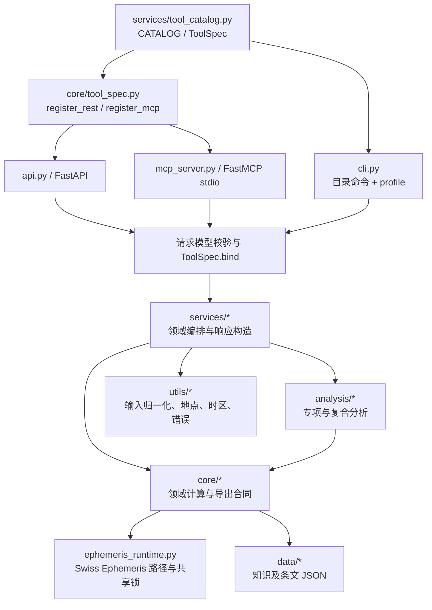
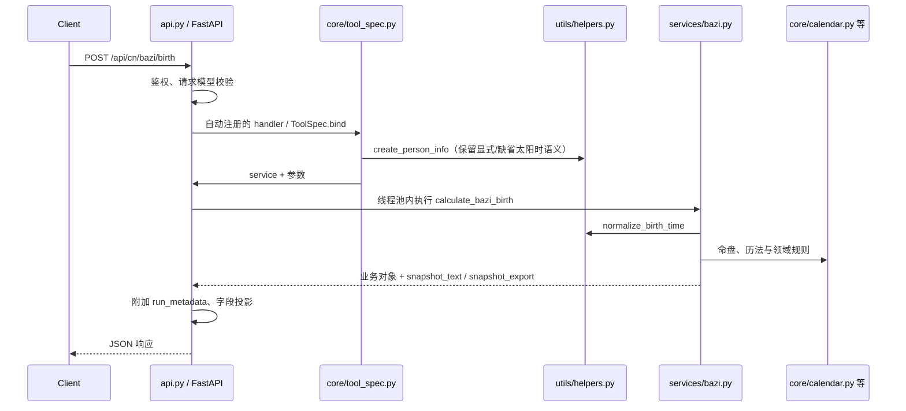

# FateBridge 架构说明

FateBridge 是一个纯后端 Python 项目，通过 REST、MCP 和 CLI 暴露领域计算。工具声明集中在 `src/fatebridge/services/tool_catalog.py` 的 `CATALOG`，请求字段集中在 `core/request_models.py`。传输层复用服务和算法，但保留各端的绑定、名称和校验方式。

## 系统概览

```mermaid
flowchart TD
    Catalog["services/tool_catalog.py<br/>CATALOG / ToolSpec"] --> Registrar["core/tool_spec.py<br/>register_rest / register_mcp"]
    Catalog --> CLI["cli.py<br/>目录命令 + profile"]
    Registrar --> REST["api.py / FastAPI"]
    Registrar --> MCP["mcp_server.py / FastMCP stdio"]
    REST --> Bind["请求模型校验与 ToolSpec.bind"]
    MCP --> Bind
    CLI --> Bind
    Bind --> Services["services/*<br/>领域编排与响应构造"]
    Services --> Analysis["analysis/*<br/>专项与复合分析"]
    Services --> Core["core/*<br/>领域计算与导出合同"]
    Services --> Utils["utils/*<br/>输入归一化、地点、时区、错误"]
    Core --> Ephe["ephemeris_runtime.py<br/>Swiss Ephemeris 路径与共享锁"]
    Core --> Data["data/*<br/>知识及条文 JSON"]
    Analysis --> Core
```

`ToolSpec` 是冻结 dataclass，包含 key、family、request/output model、绑定器、各端名称、结果转换、重计算标记等。`core/response_models.py` 定义公开根契约，复用 `core/output_western.py`、`output_charts.py`、`output_chinese.py`、`output_bazi.py`、`output_reference.py` 的专业嵌套模型；它们继承 `output_base.PartialOutput`，支持部分响应、可空事实与增量扩展，只校验而不重写业务 JSON。目录将输出模型附到 ToolSpec；`rest_specs()` / `mcp_specs()` 过滤各端集合，注册器据此挂载入口，CLI 按模型生成参数。新增工具须同时声明响应字段契约。

`core/discovery.py` 在生成 Schema 前筛选目录，供 REST `/api/tools`、CLI `discover` 和 MCP 摘要/单工具资源共用。MCP host 的 family 配置只筛选注册表；默认保留完整集合。`ToolSpec.execution_hints` 是三端发现记录与 MCP annotations 的共同来源，描述环境影响，不描述数值确定性。

当前 FastAPI 提供 87 个业务 REST 路由，另有 `GET /api/tools` 发现接口与 `/health`、`/ready`、`/metrics` 运维端点；FastMCP 默认提供 87 个 MCP 工具。中央目录包含 89 条记录，CLI 可执行其中 88 条。CLI 另有 `list`、`discover`、`describe`、`profile`；风水工具明确启用嵌套 JSON `--request-file`，关系盘嵌套入口仍使用已有扁平变体。

家居风水领域位于 `core/fengshui/`，请求、响应、公共方位、历法边界、八宅、年度飞星、玄空历史宅盘、砂水与可读快照各有模块。`services/fengshui.py` 只编排独立层和逐人差异，`data/fengshui/rules-v1.json` 保存版本与来源并随包发布。工具在中央目录显式绑定领域响应模型；`cli_request_file` 声明复杂 CLI 输入支持，不改变未启用工具的行为。规则与验收边界见 [家居风水](fengshui.md)。

目录声明让领域能力共用信源，不意味着所有端逐项同名同形：旧 `/api/calculate` 返回扁平八字命盘，`analyze_destiny` 是 MCP / CLI 综合命理；关系盘 REST 使用嵌套对象，MCP / CLI 使用扁平字段。具体映射见 [API 参考](api-reference.md#24-三端能力边界)。

## 分层职责

| 层 | 主要路径 | 职责 |
| --- | --- | --- |
| 工具声明与绑定 | `services/tool_catalog.py`、`core/tool_spec.py` | 目录、schema 绑定、REST/MCP 注册、输出投影 |
| 请求模型 | `core/request_models.py` | 必填、默认值、范围和 REST 别名 |
| 传输 | `api.py`、`mcp_server.py`、`cli.py` | HTTP/协议/参数处理，错误、元数据与输出包装 |
| 服务 | `services/*.py` | 调用核心、拼接分析、生成快照；`run_metadata.py` 生成响应溯源 |
| 分析 | `analysis/*.py` | 婚姻、事业、健康等专项及配合度/时运复合规则 |
| 核心 | `core/*.py`、`core/metaphysics/` | 历法、八字、占星、紫微、六壬、太乙等领域计算 |
| 子技法 | `core/predictive/`、`core/local_techniques/` | 西占推运和本地技法模块；两者均为目录，不是旧单文件模块 |
| 运行公共层 | `utils/helpers.py`、`places.py`、`timezones.py`、`runtime.py`、`errors.py` | 出生时间归一化、地点与时区解析、配置和错误格式 |
| 星历运行时 | `core/ephemeris_runtime.py` | 数据路径、模型标识、共享状态与并发保护 |
| 数据 | `data/knowledge/`、`data/canping/`、`data/heluo/` | 知识与条文 JSON，打包进 wheel |
| 导出 | `core/export_contracts.py`、`export_parser.py`、`services/structured_snapshot.py` | section 合同、文本解析与快照构造 |
| 验证 | `tests/`、`tests/golden/` | 领域回归、跨端对齐、完整工具面、快照与文档契约 |

## 典型请求流

### 独立八字命盘

```mermaid
sequenceDiagram
    participant C as Client
    participant A as api.py / FastAPI
    participant R as core/tool_spec.py
    participant H as utils/helpers.py
    participant S as services/bazi.py
    participant D as core/calendar.py 等
    C->>A: POST /api/cn/bazi/birth
    A->>A: 鉴权、请求模型校验
    A->>R: 自动注册的 handler / ToolSpec.bind
    R->>H: create_person_info（保留显式/缺省太阳时语义）
    R->>A: service + 参数
    A->>S: 线程池内执行 calculate_bazi_birth
    S->>H: normalize_birth_time
    S->>D: 命盘、历法与领域规则
    S-->>A: 业务对象 + snapshot_text / snapshot_export
    A->>A: 附加 run_metadata、字段投影
    A-->>C: JSON 响应
```

`api.py` 不直接手工构造领域对象。`ToolSpec.bind` 通过公共绑定器构造请求，再交服务执行。REST 同步服务均在线程池执行，标为 `cpu_bound` 的重计算另受信号量限制；这保护事件循环并限制进程内并发，不是速率限制或任务队列。

`analyze_destiny` 的 MCP / CLI 绑定进入 `services/calculation.py::calculate_destiny_analysis`，在命盘之上组织综合分析。不要把它与旧 REST 兼容绑定混为同一个执行入口。

### 快照与输出流

支持双层快照的服务生成可读的 `snapshot_text` 与 `snapshot_export`，使用 `parse_export_content` 或共享快照构造器；部分工具只有文本或结构化数据，覆盖见 [算法矩阵](algorithm-coverage.md#4-快照协议覆盖)。`selected_sections` 只筛选导出文本，完整业务数据与原快照仍在。显式选择没有命中时导出为空，不回退全文。

成功业务输出由共享模型验证，但不经模型重写，保留原有字段与数值。传输层附加 `run_metadata`，随后执行 `fields` 投影，再按选项去掉顶层 `snapshot_text`。MCP 通过 `mcp_transport.py` 返回 structuredContent、兼容 text JSON 和原生 isError；REST 返回 JSON 对象，CLI 写 stdout 并用退出码表达失败。MCP 前置 middleware 将模型错误转换为安全的统一字段提示，避免框架回显提交内容。完整选项见 [API 参考](api-reference.md#25-字段投影与输出体积)。

## 关键实现约束

出生信息归一化集中在 `utils/helpers.py`，时区解析集中在 `utils/timezones.py`。中式出生模型默认开启太阳时、核心星盘默认关闭；缺省值和用户显式选择有不同的缺经度处理，不可在适配层丢失。四柱年/月与节气、起运按实际民用时刻，日/时柱等遵循太阳钟规则；应保留原始时刻与修正结果供复核。

核心占星可走本地 `swisseph` 或轨道近似路径，显式复杂宫制缺运行时则报错。西占推运、事件和生命周期依赖 backend，缺失时不使用 FateBridge 的轨道近似替代。包可导入仍不保证星历数据存在，实际模型需检查 `ephemeris_model` 与 `engine_is_approximate`，详见 [算法覆盖](algorithm-coverage.md)。

Swiss Ephemeris 存在共享 C 状态。直接调用与会修改目录的第三方调用通过 `ephemeris_runtime.py` 的可重入锁协调；第三方操作正常或异常结束都应恢复配置目录。新增星历调用应复用这一层，避免跨请求的目录漂移。

`run_metadata` 在原 ID、时间、引擎与近似标志上增加版本、合同/输入/业务摘要、环境指纹、实际时间与重放参数。`execute_tool` 包装现有 `execute_spec`，REST 仍由原执行器限流并卸载到线程，MCP / CLI 共用执行层；execute_spec 保留无元数据的服务调用契约。ContextVar 隔离默认时钟，无 seed 随机六爻保留本次 seed，没有运行数据库。

`data/agent_scenarios.json` 从既有技能 YAML 与场景路由文档生成，`core.scenarios` 将其关联到实时 ToolSpec。REST / CLI / MCP resources 共用 manifest，生产只读 JSON，不增加 YAML 运行依赖；CI 核对生成物与源资料。

## 运行配置与边界

REST 默认监听 `0.0.0.0:8010`，可选 API Key 鉴权；CORS、运维路径豁免和配置加载见 [快速入门](getting-started.md#配置环境变量) 与 [安全策略](../SECURITY.md)。FastMCP 默认使用 stdio，由 host 启动子进程。CLI 不需要 REST 服务，`profile` 可为同一命主编排多套盘，`--subject-file` 复用出生信息。

当前项目不包含内置 Web 前端、数据库/历史存储、账户体系、队列或多服务编排。网络访问与生产控制由部署方的网关和 host 承担。

## 扩展与验证

新增能力通常先实现 `core` / `analysis`，封装 service 和 request model，再追加 `ToolSpec`。常规新增工具无需手工修改三个 transport 的领域入口，但只有声明对应 surface 且 CLI 模型可表达时才会实际暴露。

为新工具补 `tests/fixtures/surface_payloads.py` 的代表请求，运行领域回归与 `test_full_surface_validation.py`；涉及输出、默认值或投影时补跨端对齐证据。文档、场景清单及技能契约同步方式见 [开发指南](development-guide.md#文档维护与验证)。黄金快照与 CI 平台约束也在那里统一维护。

玄空版本独立放在 `data/fengshui/xuankong-v1.json`，与基础规则版本分别发布。`core/fengshui/xuankong.py` 只使用历史定运及磁北宅向，按输入误差解析候选角区；合参新增的是独立层，不给年度盘添加山向星，也不按当前元运重算宅盘。详见 [来源与合同](fengshui-xuankong.md)。
